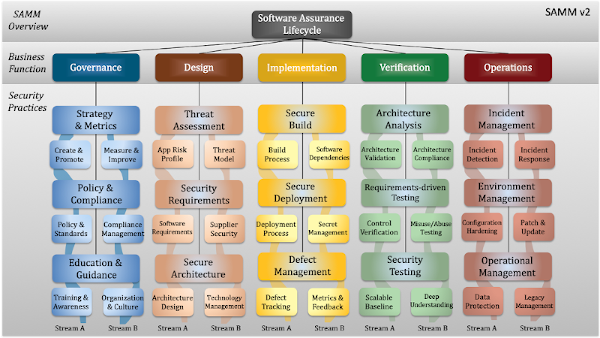

---

layout: col-sidebar
title: OWASP SAMM
tags: samm
level: 4
type: documentation

---

**Software Assurance Maturity Model**

Our mission is to provide an **effective and measurable** way for you to analyze and improve your **secure development lifecycle**. 
SAMM supports the complete software lifecycle and is **technology and process agnostic**. We built SAMM to be **evolutive and risk-driven** in nature, as there is no single recipe that works for all organizations. 
 

Check out the OWASP SAMM v2 model [online](https://owaspsamm.org/model/): 
 

 
 

**Get OWASP SAMM new delivered to your mailbox**
  - [Subscribe to our newsletter](https://owaspsamm.us9.list-manage.com/subscribe?u=b83ce65c91239cb5e623ea83e&id=cbd0520923)
    
**Join us on the OWASP SAMM project Slack channel**

  - [Join our project slack channel](https://owasp.slack.com/messages/C0VF1EJGH)
  - Invitations (self registration) via: https://owasp-slack.herokuapp.com/
    
**Join our monthly calls**

  - The monthly call is on each 2nd Wednesday of the month at 21h30 CET
    / 3:30pm ET.
  - Please join our Zoom meeting: <https://zoom.us/j/96866048960?pwd=TmZkTSs3ZmlWU09DbHJoSnVZWmdiUT09> (NEW LINK!)
  - The call is open for everybody interested in SAMM or who wants to
    work on SAMM.

The Software Assurance Maturity Model (SAMM) is an open framework to
help organizations formulate and implement a strategy for software
security that is tailored to the specific risks facing the organization.
SAMM helps you:

  - **Evaluate an organization’s existing software security practices**
  - **Build a balanced software security assurance program in
    well-defined iterations**
  - **Demonstrate concrete improvements to a security assurance
    program**
  - **Define and measure security-related activities throughout an
    organization**

*Dell uses OWASP’s Software Assurance Maturity Model (Owasp SAMM) to
help focus our resources and determine which components of our secure
application development program to prioritize.*, (**Michael J. Craigue,
Information Security & Compliance, Dell, Inc.**)

